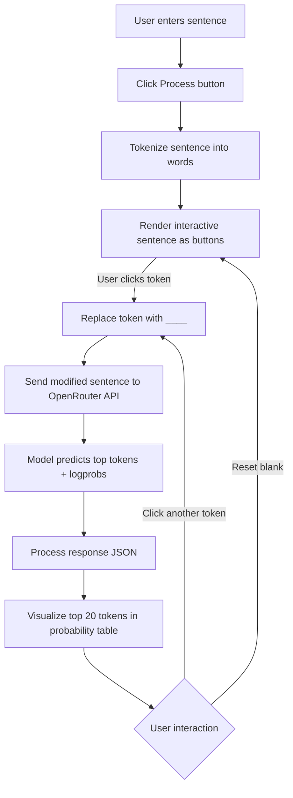

# 🧠 LLM Word Predictor

An interactive web-based application to explore how **Language Models (LLMs)** predict missing words in sentences.  
Users can enter a sentence, select a word to blank out, and let the chosen LLM predict the most likely word(s) to fill in.  
The app also visualizes token probabilities in a structured table for deeper insights.

---

## 🚀 Features

- **Model Playground** – Select from multiple OpenAI/LLM models via OpenRouter.
- **Interactive Sentence Editing** – Click any word in the sentence to blank it out (`____`) and trigger predictions.
- **Top Predictions Table** – View the top 20 model predictions with probability scores.
- **API Key Support** – Securely enter your **OpenRouter API Key** to authenticate.
- **Responsive UI** – Built with **Bootstrap 5** and **Bootstrap Icons** for a modern, mobile-friendly experience.

## ⚡ How It Works
The process flow


1. Enter a sentence in the input box.  
2. Click **Process** to tokenize the sentence.  
3. Click on any token (word) to blank it out (`____`).  
4. The app sends the modified sentence to the selected **LLM model** via OpenRouter API.  
5. The model predicts the most likely token(s) to fill the blank.  
6. A **probability table** shows the top predictions with their likelihoods.

---

## 🛠️ Setup & Usage

### 1. Clone the repository
```bash
git clone https://github.com/your-username/llm-word-predictor.git
cd LLM-FILL

